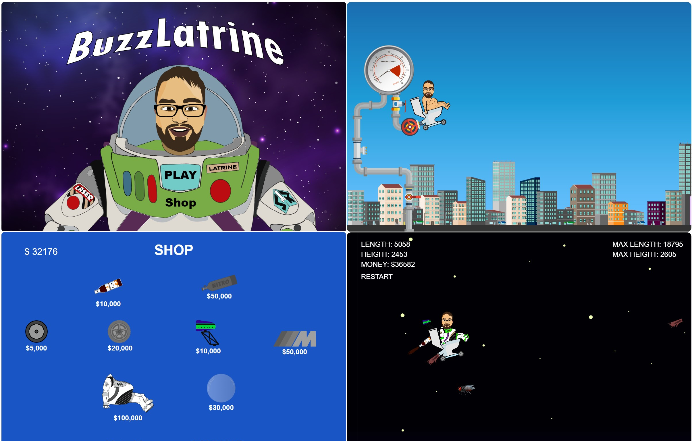

# 🚀 BuzzLatrine
A browser game built using pure JavaScript, HTML, and CSS. 

## 💿 Installation

No installation is needed for this game. Just clone the repository or download the source code, open the `index.html` file in your favorite web browser, and start playing.

```bash
git clone https://github.com/username/BuzzLatrine.git
```
## 🕹️ Game Instructions
* The game is controlled with the 🖱️ mouse.
* Aim your hero and click to launch him. 🚀
* By clicking on the hero, you can use the special flush ability. 🌊
* Try to avoid the flies that slow you down. 🪰
* In the shop, you can buy various upgrades for your hero. 💲
* Try to reach as high as possible and have fun! 🎉

## 📸 Screenshots

